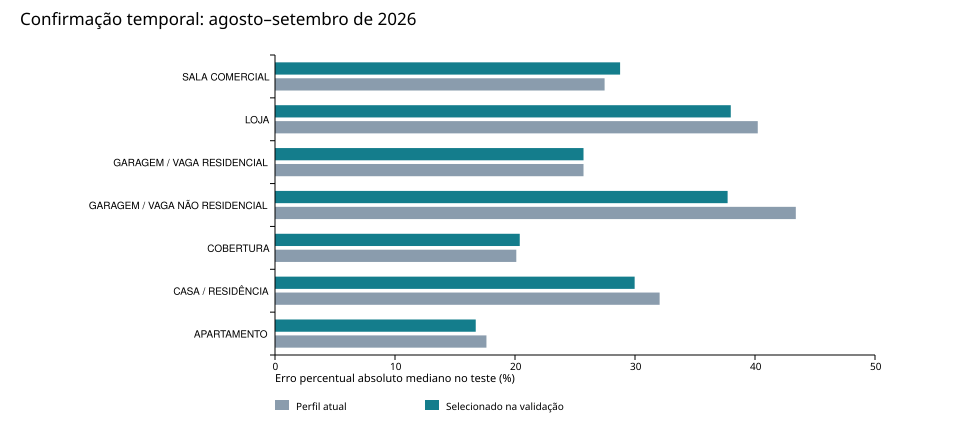

# Calibração SIRI — 23/09/2026

## Resultado e decisão

Foram auditadas **730.246 linhas**, com 159.120 guias ITBI e 571.126 ofertas, de 23/09/2023 a 22/09/2026.
Há 128.565 inscrições e 319.467 combinações distintas de tipo, inscrição e preço: linhas não equivalem a imóveis independentes.
A busca operacional examinou **3060 configurações por finalidade somadas**, em 8 finalidades com amostra suficiente,
e avaliou os finalistas em **1390 alvos** de agosto–setembro de 2026.

**K, pesos e pisos abaixo são os candidatos selecionados na validação, não uma garantia de ótimo global.**
Nenhum parâmetro foi copiado automaticamente para o aplicativo. A decisão por finalidade está em `parametros_por_finalidade.csv`.
A correção da área dos terrenos em condomínio foi implementada no aplicativo e testada separadamente.

**Universo operacional:** conforme esclarecimento do usuário, guias abaixo dos pisos atuais não representam
o mercado a calibrar. A tabela principal usa somente alvos acima de um piso de elegibilidade FIXO por finalidade,
igual ao perfil anterior à busca. Esse piso é comum a todos os candidatos. Os pisos candidatos variam apenas
no treino. Assim, o candidato não melhora artificialmente por escolher quais alvos serão pontuados.
É uma avaliação condicionada à hipótese operacional desses pisos, não uma certificação de cada transação.
O CSV identifica quais testes usaram novos imóveis e quais reutilizaram os casos da rodada diagnóstica.

| Finalidade | K | Físico / geográfico | Piso R$/m² | n teste | MdAPE atual → candidato |
| --- | --- | --- | --- | --- | --- |
| APARTAMENTO | 32 | 10,0% / 90,0% | 2.400 | 350 | 17,6% → 16,7% |
| CASA / RESIDÊNCIA | 5–15 | 25,0% / 75,0% | 0 | 196 | 32,1% → 30,0% |
| COBERTURA | 16 | 25,0% / 75,0% | 0 | 75 | 20,1% → 20,4% |
| GARAGEM / VAGA NÃO RESIDENCIAL | 48 | 66,7% / 33,3% | 0 | 80 | 43,4% → 37,7% |
| GARAGEM / VAGA RESIDENCIAL | 7–30 | 66,7% / 33,3% | 200 | 350 | 25,7% → 25,7% |
| LOJA | 8 | 45,0% / 55,0% | 350 | 34 | 40,2% → 38,0% |
| SALA COMERCIAL | 32 | 60,0% / 40,0% | 450 | 228 | 27,5% → 28,8% |
| TERRENO | 8 | 10,0% / 90,0% | 0 | 77 | 117,1% → 61,5% |

Piso significa limite de aceitação do valor unitário ORIGINAL dos comparáveis, antes do desconto de oferta;
não é limite mínimo da estimativa. As áreas são privativas para apartamentos, coberturas, salas, vagas e lojas;
construídas para casas; área do lote/unidade para terrenos. Não transportar estes pisos para outro regime.
K em intervalo é adaptativo. O mínimo de vizinhos efetivos e os outros controles estão no JSON e no CSV.
Na configuração de K fixo, o número efetivo de vizinhos pode ser menor que K.
Piso candidato zero desativa somente esse corte absoluto: os filtros robustos global e local continuam ativos.
Uma vantagem pequena do piso zero não basta para recomendar sua adoção em outras bases.

## Equidade e dispersão no teste

| Finalidade | COD atual (%) | COD candidato (%) | PRD atual | PRD candidato | Razão mediana candidata |
| --- | --- | --- | --- | --- | --- |
| APARTAMENTO | 30.357 | 29.764 | 1.054 | 1.060 | 0.963 |
| CASA / RESIDÊNCIA | 58.334 | 58.605 | 1.287 | 1.285 | 1.078 |
| COBERTURA | 36.853 | 36.994 | 1.204 | 1.230 | 1.000 |
| GARAGEM / VAGA NÃO RESIDENCIAL | 90.407 | 93.709 | 1.666 | 1.715 | 0.994 |
| GARAGEM / VAGA RESIDENCIAL | 51.607 | 51.607 | 1.311 | 1.311 | 0.990 |
| LOJA | 37.565 | 48.588 | 1.185 | 1.209 | 1.207 |
| SALA COMERCIAL | 37.535 | 38.193 | 1.290 | 1.307 | 1.122 |
| TERRENO | 53.087 | 60.890 | 1.318 | 0.958 | 1.329 |

COD é expresso em porcentagem; PRD e razão mediana são adimensionais. PRD foi calculado com valores totais.
As razões elevadas nos estratos de baixo valor apontam risco de regressividade, mas não permitem atribuí-lo
integralmente ao modelo: ainda pode haver frações de direitos e inconsistências de área acima dos pisos.
A rodada bruta foi mantida nas subpastas sem sufixo. Exemplo: linha Excel 165.319 registra R$ 2,29 para uma casa;
foi excluída do universo operacional pelo piso fixo, coerentemente com a finalidade do filtro esclarecida pelo usuário.
A melhora de MdAPE, sozinha, não demonstra equidade tributária.
O arquivo `diagnosticos_por_estrato.csv` contém PRB, decis de valor, bairros, células espaciais e períodos.
Grupos pequenos são descritivos; estratificar pelo preço observado também pode produzir associação mecânica.

## Área dos terrenos em condomínio

O usuário esclareceu que é necessário usar a área da unidade negociada. O schema agora prioriza
`area_lote_negociada`, `area_terreno_unidade` ou `crawler_area_terreno` para terrenos explicitamente
identificados como condomínio. Preserva a área SIAT original, registra a regra e deixa a área efetiva
ausente quando falta área de unidade válida. Não infere condomínio por tamanho ou preço.

Foram alteradas **765 linhas**. Na comparação pareada de **88 guias**,
mantendo K, pesos e piso atuais, o MdAPE passou de **195,4%** para **157,8%**.
Isso é uma comparação **exploratória após diagnóstico**, não uma confirmação independente: o teste já havia sido observado.
O resultado detalhado está em `terreno_area_negociada/`, e as linhas alteradas em `land_area_corrections.csv`.
Registros rotulados apenas TERRENO ainda podem conter área fiscal coletiva; precisam de identificação cadastral.
A interpretação de `crawler_area_terreno` como área negociada nas guias é uma hipótese apoiada pelo esclarecimento
do usuário, não uma verificação documental das transações. A testada continua sendo a disponível na extração.

## Protocolo reproduzível

1. Normalização sem alvo e seleção do regime principal de área. Sem imputar preços ou usar preço como atributo.
2. Fixar elegibilidade de mercado pelo piso anterior à busca e validar períodos futuros:
   fev–jul/2025, ago/2025–jan/2026 e fev–jul/2026, sempre com treino anterior ao início.
3. Antes de qualquer filtro, deduplicação, desconto ou padronização, retirar do treino inscrições e
   assinaturas coordenadas/áreas dos alvos. Assinatura conservadora arredonda coordenadas a cinco casas e áreas a m².
4. Triagem aproximada: até 6.000 linhas de treino e 24 alvos por período; omite filtro local para reduzir custo.
   Grade: K fixos 5, 8, 12, 16, 24, 32 e 48; faixas 5–15, 8–24, 12–36 e 16–48;
   faixa atual; pesos físicos 10%, 25%, 45%, 60%, 75%, 90% e o atual;
   pisos zero, metade, atual, 1,5× e 2× o atual. Peso geográfico é 1 menos peso físico.
5. Reavaliar dois melhores da triagem, melhor de cada piso e perfil atual com **núcleo completo**,
   todo treino elegível e até 90 alvos por período. A triagem não avalia exaustivamente toda a grade com o núcleo completo.
6. Critério definido no script antes da busca: erro logarítmico absoluto médio + 0,25×COD/100
   + 0,5×|ln(razão mediana)| + 0,5×|ln(PRD)|, com penalização de instabilidade entre períodos e falhas.
   É um critério de trabalho, não um índice normativo. Preços anômalos podem dominar o componente COD.
7. Congelar seleção em `locked_selection.json`, antes do teste de 01/08/2026 a 22/09/2026.
   Até 350 guias por finalidade; alvo nunca excluído pelo piso CANDIDATO ou por outlier estatístico de preço.
   Quando restaram pelo menos 50 alvos válidos ainda não avaliados na rodada bruta, usar somente esses novos alvos.
   Caso contrário, registrar reutilização do teste condicionado ao piso fixo. A configuração territorial já usa área corrigida.
8. Teste espacial de até 60 alvos, retirando a célula de aproximadamente 1 km do treino e refazendo a preparação.
   Células usam latitude/longitude com aproximação local, sem faixa de isolamento nas bordas.
9. IC de 95% do ganho de MdAPE por 1.000 reamostragens pareadas de células espaciais. Semente: 23092026.
   IC que inclui zero não comprova ganho. Não mede a incerteza de toda a busca nem corrige seleção múltipla.

As coordenadas são interpretadas como EPSG:4326. Alvos restringem-se à janela -31 a -29 de latitude e -52 a -50
de longitude, coerente com a área de Porto Alegre. A distância usa aproximação equiretangular em km.
Distância física usa atributos de área e ano quando disponível; casas incluem também área do terreno.
As escalas robustas (IQR/MAD) são calculadas apenas nos candidatos de treino. A escala geográfica é a mediana
das distâncias do treino ao alvo, limitada a 0,25–20 km. O filtro local mantém os raios do aplicativo (5/10 km).
Mudar o peso físico não representa a mesma troca em metros; os componentes são padronizados.

## Finalidades sem sustentação para ajuste específico

Estas categorias não atingiram 90 alvos nos períodos de validação e 30 no teste final.
Os números abaixo são **parâmetros atuais preservados, não parâmetros otimizados**.

| Finalidade | K mínimo atual | K máximo atual | Peso físico atual | Piso atual (R$/m²) |
| --- | --- | --- | --- | --- |
| CONSTRUÇÃO EM ÁREA DE GLEBA | 12 | 25 | 45,0% | 100.0 |
| FLAT / APART-HOTEL | 12 | 25 | 45,0% | 1200.0 |
| GALPÃO / DEPÓSITO | 12 | 25 | 45,0% | 650.0 |
| GARAGEM / VAGA | 7 | 30 | 66,7% | 150.0 |
| GLEBA | 12 | 25 | 45,0% | 20.0 |
| HOTEL | 12 | 25 | 45,0% | 400.0 |
| IMÓVEL COMERCIAL | 12 | 25 | 45,0% | 850.0 |
| IMÓVEL ESPECIAL | 12 | 25 | 45,0% | 400.0 |
| LOJA EM GALERIA | 12 | 25 | 45,0% | 1000.0 |
| LOJA EM SHOPPING | 12 | 25 | 45,0% | 1200.0 |

## Limitações e próximos controles

- 47.654 linhas sem finalidade normalizável não entraram na busca por finalidade.
- Nenhuma linha veio rotulada como aluguel. Existem 33 ofertas com valor total até R$ 10 mil;
  a classificação merece revisão, sem presumir que todas sejam locações.
- `data_encaminhamento` é data de disponibilidade cadastral, não data comprovada de negócio ou avaliação.
  Valores nominais dos três anos foram mantidos; não houve correção monetária presumida.
- A extração atual pode incorporar revisões cadastrais posteriores. Sem snapshots históricos,
  não é possível excluir inteiramente esse tipo de informação retrospectiva.
- Piso e corte de cauda podem remover submercados baratos legítimos e aumentar regressividade.
  O universo principal assume válidos os pisos atuais para identificar mercado; sua validade exige auditoria cadastral.
  Só o piso do treino varia na busca. A avaliação bruta anterior fica preservada para rastreabilidade.
- O preditor é média winsorizada em escala original; log é usado em filtros e no critério de seleção,
  não há retransfomação de uma previsão logarítmica nem necessidade automática de smearing.
- Amostra limitada, dependência espacial e busca extensa criam risco de overfitting.
  Não houve otimização da potência de distância, limite individual, MAD, raios ou correção temporal.
- Resultados referem-se ao regime principal e à configuração de atributos descrita; não validam automaticamente
  estimativas sem ano, sem localização ou com regime alternativo de área.
- As razões são em relação a valores declarados de ITBI, não comprovação de valor de mercado ou conformidade tributária.

## Arquivos e verificação

- `parametros_por_finalidade.csv`: comparação completa e decisão operacional.
- `parametros_candidatos.json`: configurações propostas, preservando parâmetros não pesquisados.
- `decisao_e_incerteza.csv`: situação de cada candidato e intervalo do ganho de erro mediano.
- `baseline_parameters.json`: fotografia das configurações do aplicativo antes da análise.
- `diagnosticos_por_estrato.csv`: métricas de equidade, tempo, localização e valor.
- `casos_para_revisao.csv`: casos do teste ordenados por erro, com linha Excel para rastreamento.
- `cobertura_universo_operacional.csv`: quantos imóveis passam pelos requisitos e pelo piso fixo.
- `vizinhos_efetivos_teste.csv`: K realizado, tamanho efetivo e frequência de meta não atingida.
- Subpastas: grade de triagem, ranking de validação, seleção congelada e previsões individuais.
- `provenance.json`: SHA-256 da fonte e dos módulos originais.
- Scripts `calibration_audit.py`, `calibrate_siri.py`, `calibration_report.py`: reprodução local.
  Rodar `python calibration_audit.py`, `python calibrate_siri.py --workers 3`,
  `python calibrate_siri.py --corrected-land`, `python calibrate_siri.py --market --workers 3`
  e `python calibration_report.py`.
  O cache `enriched.pkl` preserva o schema original desta rodada. Removê-lo após modificar o schema muda o experimento.

Referências metodológicas: [IAAO, Standard on Ratio Studies (2013)](https://www.iaao.org/wp-content/uploads/Standard_on_Ratio_Studies.pdf)
para COD/PRD/PRB, e [scikit-learn, prevenção de vazamento](https://github.com/scikit-learn/scikit-learn/blob/main/doc/common_pitfalls.rst)
para separação antes da preparação. Nenhum limite normativo de aprovação foi atribuído a estes resultados.
